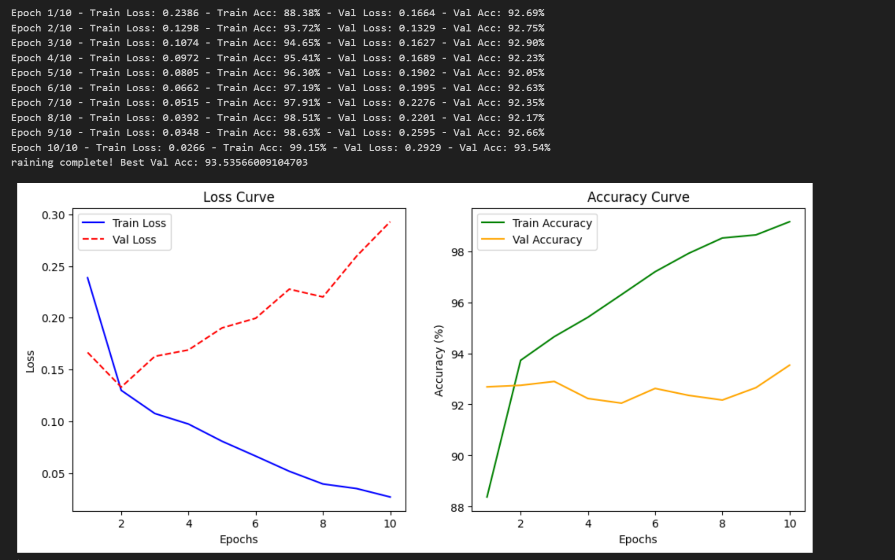

# Deepfake Detection Project

## Mô tả
Dự án này sử dụng mô hình deep learning để phân loại video có thật hay giả mạo (deepfake). Hệ thống bao gồm các bước xử lý video, trích xuất khuôn mặt, huấn luyện mô hình, dự đoán và đánh giá.

## Cấu trúc thư mục
```
- best_model.pth       # Trọng số của mô hình đã huấn luyện
- detect_from_video.py # Trích xuất khuôn mặt từ video
- load_data.py         # Load dữ liệu cho huấn luyện
- model.py             # Định nghĩa mô hình deep learning
- predict.py           # Dự đoán trên ảnh hoặc video
- train.py             # Huấn luyện và đánh giá mô hình
```

## Cài đặt
Yêu cầu Python >= 3.8 và các thư viện cần thiết:
```bash
pip install torch torchvision timm facenet-pytorch opencv-python tqdm numpy pillow matplotlib scikit-learn
```

## Sử dụng

### 1. Trích xuất khuôn mặt từ video
```bash
python detect_from_video.py --video_path input.mp4 --output_folder extracted_faces
```

### 2. Huấn luyện mô hình
```bash
python train.py --epochs 20 --lr 0.001 --device cuda
```

### 3. Dự đoán trên video
```bash
python predict.py --video_path test_video.mp4 --model_path best_model.pth
```

## Mô hình sử dụng
Mô hình được sử dụng là `Xception`, tải sẵn trọng số ImageNet và tinh chỉnh trên tập dữ liệu deepfake.

## Liên hệ
Nếu có thắc mắc hoặc cần hỗ trợ, vui lòng liên hệ qua email: `tini.vu.0@gmail.com`


## Kết quả huấn luyện

Biểu đồ dưới đây thể hiện quá trình huấn luyện mô hình:


